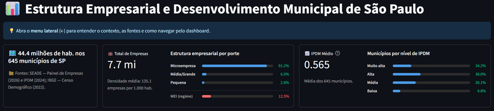
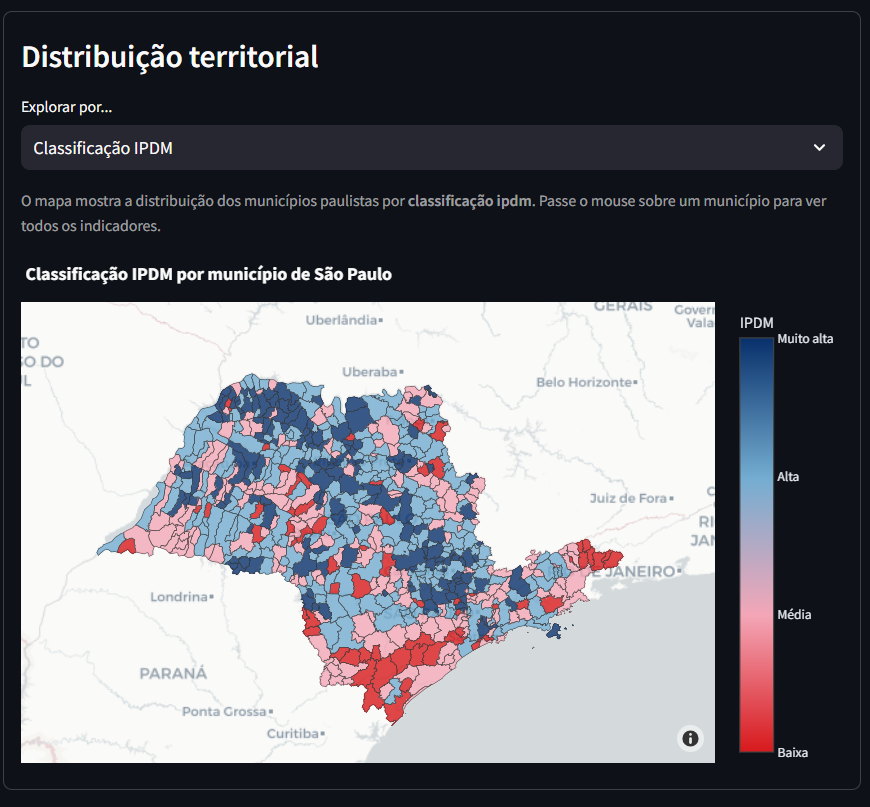
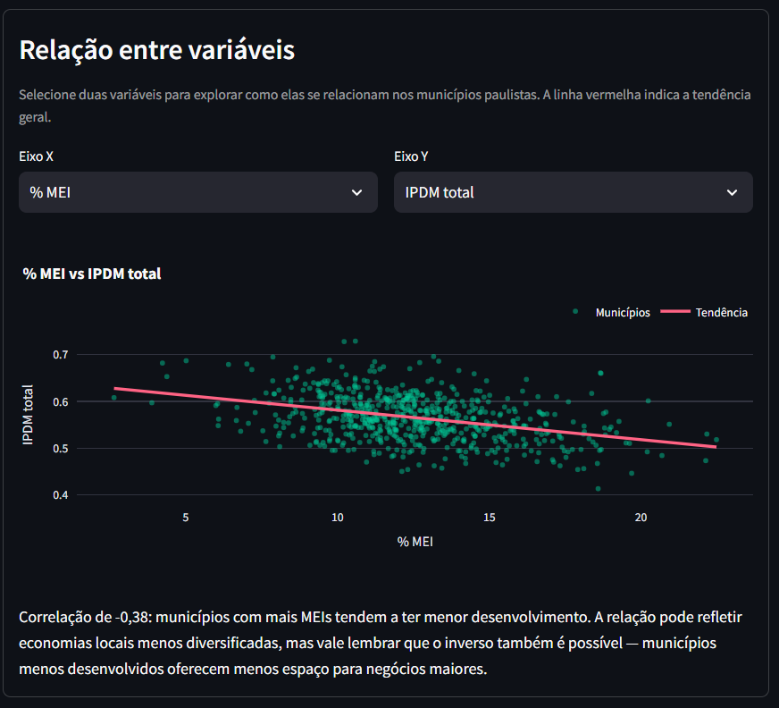
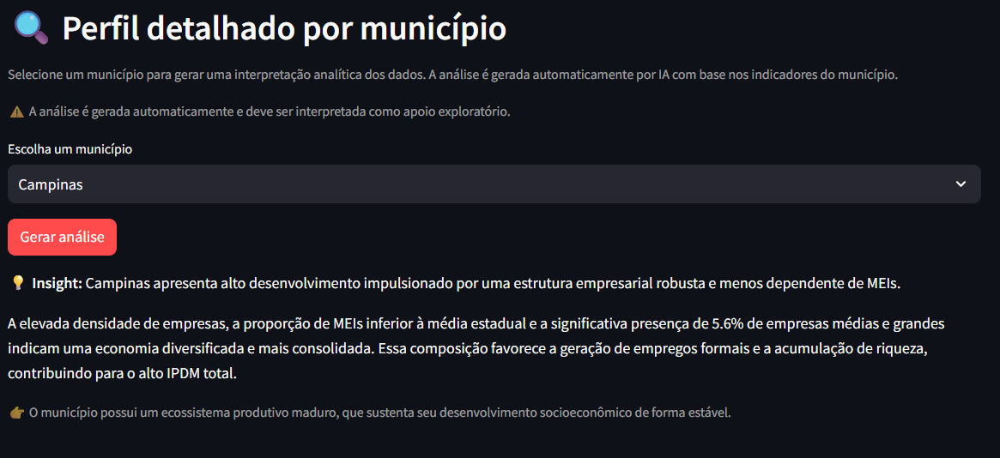

# Estrutura Empresarial e Desenvolvimento Municipal de São Paulo

**Dashboard interativo:** https://empresas-vs-ipdm-sp.streamlit.app/  
**Repositório:** https://github.com/st-ricardof/empresas-em-sp

---

## O projeto em 30 segundos

Investiguei se municípios com mais empresas são mais desenvolvidos — hipótese intuitiva, mas que os dados contradizem.

Cruzei três bases públicas (de porte de empresas, índice paulista de desenvolvimento municipal e população) cobrindo os **645 municípios do estado de São Paulo** (44,4 milhões de habitantes, 7,7 milhões de empresas) e construí um dashboard interativo com camada de interpretação por IA generativa.

**Resultado central**: o nível de desenvolvimento está mais associado à **estrutura econômica e a fatores sociais** do que à quantidade de empresas. O volume total de empresas praticamente não explica o desenvolvimento (correlação: 0,03), enquanto **municípios com maior proporção de MEIs tendem a apresentar menor IPDM (correlação: -0,38)**.

---

## Resultados analíticos

| Relação analisada | Correlação | O que isso significa |
|---|---|---|
| Total de empresas × IPDM | **+0,03** | Volume de empresas praticamente irrelevante |
| % MEI × IPDM | **-0,38** | Maior concentração de MEIs associada a menor desenvolvimento |
| % Pequenas × Riqueza municipal | **+0,36** | Pequenas empresas têm associação mais positiva que MEIs |
| Escolaridade × IPDM | **+0,76** | Fator com maior associação ao desenvolvimento municipal |
| % Microempresas × % Demais portes | **-0,93** | Estrutura altamente concentrada em micro |

Adicionalmente: 91,2% das empresas no estado são microempresas; 12,5% operam no regime MEI.

> **Interpretação:** o achado não invalida política de fomento empresarial — mas sugere que *qualidade da estrutura produtiva* e *capital humano* têm peso maior do que volume de negócios no desenvolvimento local.

---

## Screenshots


*Big numbers descritivos e proporções das principais méticas estaduais: 645 municípios, 7,7 mi de empresas e distribuição por porte*


*Distribuição territorial do IPDM — municípios com IPDM muito alto concentrados na macrometrópole*


*Correlação de -0,38 entre proporção de MEIs e desenvolvimento municipal*


*Interpretação gerada automaticamente por município com Gemini 2.5 Flash*


## O que foi construído

### Pipeline de dados
- Ingestão de 3 fontes heterogêneas (SEADE Empresas 2026, SEADE IPDM 2025, IBGE Censo 2022)
- Processamento e integração em banco DuckDB com camada de views analíticas
- Tratamento de inconsistências entre bases com anos distintos e diferentes granularidades

### Dashboard (Streamlit)
O dashboard foi estruturado em três camadas analíticas:

**Visão geral estadual** — KPIs sobre população, empresas e IPDM médio, com distribuição por porte e classificação de desenvolvimento

**Distribuição territorial** — mapa interativo dos 645 municípios com múltiplas camadas de variáveis; tooltip com todos os indicadores ao hover

**Relação entre variáveis** — scatter plot dinâmico com seleção de eixos e linha de tendência, acompanhado de interpretação contextual automática

### Dicionário interpretativo
Criei um sistema com mais de **50 combinações de variáveis pré-mapeadas**, que traduz automaticamente a correlação exibida no scatter em linguagem analítica acessível. Cada combinação retorna uma leitura específica sobre o que aquela relação pode indicar economicamente — não apenas o valor numérico.

### Camada de IA generativa (Gemini 2.5 Flash)
Para cada município, o sistema gera uma interpretação analítica estruturada em três dimensões:
- **Insight principal** — síntese do perfil do município em uma frase
- **Leitura analítica** — conexão entre IPDM, estrutura empresarial, densidade e composição por porte, comparando com a média estadual
- **Implicação econômica** — interpretação orientada a contexto local

O prompt foi engenheirado para forçar especificidade: inclui benchmarks estaduais em tempo real, proíbe descrições isoladas de variáveis e exige que a resposta conecte pelo menos dois indicadores. O output é parseado programaticamente e renderizado em três blocos distintos.

---

## Decisões analíticas relevantes

**Por que IPDM e não PIB?** O PIB municipal mais recente disponível era de 2020 — defasagem de 6 anos em relação aos dados de empresas. O IPDM (2025) é mais atual, multidimensional e cobre as mesmas dimensões relevantes para esta análise.

**Por que DuckDB?** Para análises locais em dados tabulares de médio volume, DuckDB oferece desempenho superior ao Pandas puro com sintaxe SQL familiar. A camada de views permite separar a lógica analítica da camada de apresentação.

**O resultado contraintuitivo como achado legítimo.** A hipótese inicial (mais empresas → mais desenvolvimento) foi refutada pelos dados. A análise reconhece esse limite explicitamente em vez de forçar uma narrativa — o que também é informação relevante para gestores públicos e formuladores de política.

---

## Implicações práticas

Para gestores e analistas de política pública, os dados sugerem que:

- Programas de fomento focados apenas em abertura de empresas podem ter impacto limitado no IPDM
- Incentivar a transição de MEIs para pequenas empresas pode ser mais eficaz do que aumentar volume bruto
- Educação emerge como variável-chave — com correlação 20x maior do que o número de empresas

> Esta análise é descritiva e exploratória. Correlação não implica causalidade. Os achados devem ser complementados com análise local e conhecimento territorial.

---

## Stack tecnológica

| Camada | Tecnologia |
|---|---|
| Linguagem | Python 3.11 |
| Banco de dados | DuckDB |
| Análise | Pandas, NumPy |
| Visualização | Plotly, GeoPandas |
| Dados geográficos | geobr |
| Dashboard | Streamlit |
| IA generativa | Google Gemini 2.5 Flash |
| Exploração | Jupyter Notebooks |

---

## Como rodar localmente

```bash
git clone https://github.com/st-ricardof/empresas-em-sp
cd empresas-em-sp

python -m venv venv
source venv/bin/activate  # Windows: venv\Scripts\activate
pip install -r requirements.txt

streamlit run app/app.py
```

Os dados processados estão disponíveis em `data/processed/`. Para reproduzir o pipeline completo a partir das fontes brutas, consulte os notebooks em `/notebooks`.

Para usar a funcionalidade de análise por IA, configure sua chave de API no arquivo `.streamlit/secrets.toml`:
```toml
GEMINI_API_KEY = "sua-chave-aqui"
```

---

## Limitações

- Correlação não implica causalidade — os padrões observados indicam associações, não relações causais
- Bases com anos distintos (2022–2026) — a comparação entre períodos diferentes introduz ruído na análise
- Ausência de variáveis estruturais importantes como renda domiciliar detalhada e infraestrutura
- A interpretação gerada por IA é apoio exploratório, não substitui análise técnica aprofundada ou conhecimento local

---

## Fontes

| Dataset | Fonte | Ano |
|---|---|---|
| Painel de Empresas SP | SEADE | 2026 |
| Índice Paulista de Desenvolvimento Municipal (IPDM) | SEADE | 2025 |
| Censo Demográfico | IBGE | 2022 |

---

## Autor

**Ricardo Fernando dos Santos** — São Paulo, Brasil

[](https://github.com/st-ricardof)
[](https://www.linkedin.com/in/st-ricardof/)
[](mailto:st.ricardof@gmail.com)
